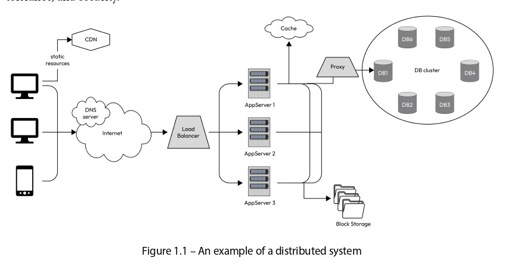

# **System Design** 🌟

## What is System Design? 📐  
System design is the process of defining the architecture, components, interfaces, and other characteristics of a system to meet specified requirements. It involves creating a blueprint for how a system will function, ensuring it is reliable, scalable, and secure. 🔒

## What is a Software System? 💻  
A software system is a collection of software components, modules, and programs that work together to perform a specific task or set of tasks. It can be as simple as a single program or as complex as a distributed system spanning multiple devices and networks.  
**Example:** An online shopping app is a software system. It includes components for displaying product lists, processing payments, and tracking orders—all working together to provide a seamless shopping experience. 🛒

## What is a Distributed Software System? 🌐  
A distributed software system consists of multiple independent components, processes, or nodes that communicate and coordinate to achieve a common goal. Unlike a centralized system where everything runs on a single machine, a distributed system is spread across multiple machines, networks, and geographical locations.  
**Example:** Google’s search engine is a distributed system. When you search for something, your request is processed by servers located worldwide, working together to deliver results quickly. 🔍

## Challenges in Distributed Systems ⚠️  
Designing distributed systems is challenging due to several factors:  
- **Network Communication:** Ensuring components communicate effectively over networks. 📡  
- **Data Consistency:** Keeping data synchronized across multiple nodes. 📊  
- **Availability:** Ensuring the system remains operational even during failures. 🟢  
- **Fault Tolerance:** Handling failures gracefully without affecting the entire system. 🛠️  
- **Security:** Protecting the system from unauthorized access and attacks. 🔐  
**Example:** In an online banking system, if one server goes down, the system must ensure other servers can still process transactions securely and without interruption. 🏦

  

## Example of a Distributed System (Based on Figure 1.1) 🖼️  
The figure illustrates a distributed system with various components. Here’s a detailed breakdown:  

1. **User Devices:** On the left, there are user devices like laptops, mobile phones, and tablets. These are the devices users interact with to send requests, such as accessing a website or app. 📱💻  
2. **Internet:** Requests travel through the internet to reach the system’s servers. 🌍  
3. **DNS Server:** The Domain Name System (DNS) server translates domain names (e.g., www.example.com) into IP addresses, directing the request to the correct destination. 🌐  
4. **CDN (Content Delivery Network):** The CDN stores static resources like images, videos, and scripts, delivering them quickly to users by caching them closer to their location. 📦  
5. **Load Balancer:** This component distributes incoming requests across multiple app servers to prevent any single server from becoming overloaded, ensuring balanced performance. ⚖️  
6. **App Servers (App Server 1, 2, 3):** These servers handle the core processing of user requests, such as retrieving product details or processing a search query. 🖥️  
7. **Proxy:** A proxy server acts as an intermediary, routing requests and adding a layer of security by filtering traffic. 🛡️  
8. **Cache:** A cache stores frequently accessed data (e.g., user profiles or product info) to reduce the load on databases and speed up response times. ⚡  
9. **DB Cluster (DB1, DB2, DB3, DB4, DB5, DB6):** This is a group of databases that store the system’s data, such as user information, product catalogs, or transaction records. Data is distributed across multiple databases for redundancy and scalability. 🗄️  
10. **Block Storage:** This storage system is used for large data, such as files, backups, or media, providing scalable and reliable storage. 📂  

### How the Distributed System Works 🔄  
- A user sends a request (e.g., opening a website) from their device.  
- The request goes through the DNS server, which resolves the domain name to an IP address.  
- The load balancer distributes the request to one of the app servers (App Server 1, 2, or 3) based on current load.  
- The app server first checks the cache for the required data; if not found, it queries the database cluster.  
- If large files are needed (e.g., images or videos), they are fetched from the block storage or CDN.  
- Finally, the processed response is sent back to the user through the same path. 🚀

This architecture ensures scalability, fault tolerance, and fast response times, making it ideal for large-scale applications like e-commerce platforms, social media, or cloud services. 🌟