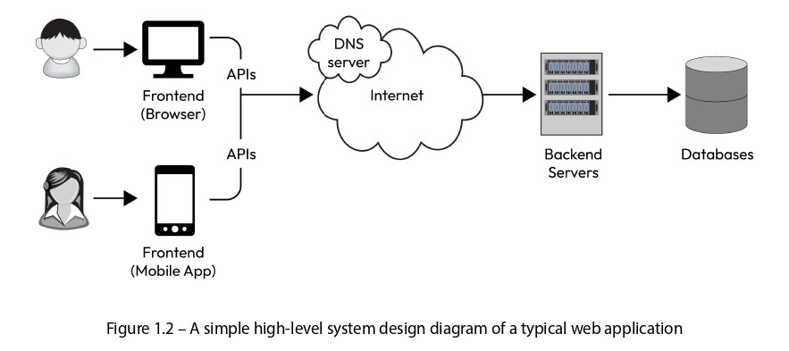

# **System Design** 🌟

## What is System Design? 📐  
System design is the process of defining the architecture, components, interfaces, and other characteristics of a system to meet specified requirements. It involves creating a blueprint for how a system will function, ensuring it is reliable, scalable, and secure. 🔒

## What is a Software System? 💻  
A software system is a collection of software components, modules, and programs that work together to perform a specific task or set of tasks. It can be as simple as a single program or as complex as a distributed system spanning multiple devices and networks.  
**Example:** An online shopping app is a software system. It includes components for displaying product lists, processing payments, and tracking orders—all working together to provide a seamless shopping experience. 🛒

## What is a Distributed Software System? 🌐  
A distributed software system consists of multiple independent components, processes, or nodes that communicate and coordinate to achieve a common goal. Unlike a centralized system where everything runs on a single machine, a distributed system is spread across multiple machines, networks, and geographical locations.  
**Example:** Google’s search engine is a distributed system. When you search for something, your request is processed by servers located worldwide, working together to deliver results quickly. 🔍

## Challenges in Distributed Systems ⚠️  
Designing distributed systems is challenging due to several factors:  
- **Network Communication:** Ensuring components communicate effectively over networks. 📡  
- **Data Consistency:** Keeping data synchronized across multiple nodes. 📊  
- **Availability:** Ensuring the system remains operational even during failures. 🟢  
- **Fault Tolerance:** Handling failures gracefully without affecting the entire system. 🛠️  
- **Security:** Protecting the system from unauthorized access and attacks. 🔐  
**Example:** In an online banking system, if one server goes down, the system must ensure other servers can still process transactions securely and without interruption. 🏦

  

## Example of a Distributed System (Based on Figure 1.1) 🖼️  
The figure illustrates a distributed system with various components. Here’s a detailed breakdown:  

1. **User Devices:** On the left, there are user devices like laptops, mobile phones, and tablets. These are the devices users interact with to send requests, such as accessing a website or app. 📱💻  
2. **Internet:** Requests travel through the internet to reach the system’s servers. 🌍  
3. **DNS Server:** The Domain Name System (DNS) server translates domain names (e.g., www.example.com) into IP addresses, directing the request to the correct destination. 🌐  
4. **CDN (Content Delivery Network):** The CDN stores static resources like images, videos, and scripts, delivering them quickly to users by caching them closer to their location. 📦  
5. **Load Balancer:** This component distributes incoming requests across multiple app servers to prevent any single server from becoming overloaded, ensuring balanced performance. ⚖️  
6. **App Servers (App Server 1, 2, 3):** These servers handle the core processing of user requests, such as retrieving product details or processing a search query. 🖥️  
7. **Proxy:** A proxy server acts as an intermediary, routing requests and adding a layer of security by filtering traffic. 🛡️  
8. **Cache:** A cache stores frequently accessed data (e.g., user profiles or product info) to reduce the load on databases and speed up response times. ⚡  
9. **DB Cluster (DB1, DB2, DB3, DB4, DB5, DB6):** This is a group of databases that store the system’s data, such as user information, product catalogs, or transaction records. Data is distributed across multiple databases for redundancy and scalability. 🗄️  
10. **Block Storage:** This storage system is used for large data, such as files, backups, or media, providing scalable and reliable storage. 📂  

### How the Distributed System Works 🔄  
- A user sends a request (e.g., opening a website) from their device.  
- The request goes through the DNS server, which resolves the domain name to an IP address.  
- The load balancer distributes the request to one of the app servers (App Server 1, 2, or 3) based on current load.  
- The app server first checks the cache for the required data; if not found, it queries the database cluster.  
- If large files are needed (e.g., images or videos), they are fetched from the block storage or CDN.  
- Finally, the processed response is sent back to the user through the same path. 🚀

---

## **More Specific System Design Definition**? 📐

System design is the process of defining the architecture, components, modules, interfaces, and interactions of a software system to meet its functional and non-functional requirements. It involves creating a blueprint that outlines how the system will be structured, implemented, and maintained. 🔧

> **Note:** The goal of system design is to create a design that is easy to understand, maintain, and extend while meeting performance, scalability, reliability, and security requirements. The design should also be flexible to accommodate future changes in requirements or the environment. 🔄

## System Design Process 🛠️

The system design process typically involves the following steps:

1. **Requirements Analysis** 📝\
   Understand and define the functional (what the system does) and non-functional (how the system performs) requirements. This step also involves analyzing read-and-write patterns to optimize the system design.\
   **Example:** For a chat app, a functional requirement is that users can send and receive messages. A non-functional requirement is that the app should handle 1 million users without slowing down. 💬
2. **High-Level Architecture Design** 🏗️\
   Define the overall structure of the system, including its components, modules, and interfaces (see Figure 1.2 for an example).\
   **Example:** For a chat app, the high-level design might include a frontend (user interface), backend servers (to handle messages), and a database (to store messages). 🌐
3. **Detailed Design** 🔍\
   Define the internal structure and behavior of each component and module, including core algorithms and interaction mechanisms between components.\
   **Example:** For a chat app, the detailed design might specify how messages are encrypted, how the backend authenticates users, and how messages are stored in the database. 🗄️
4. **User Interface Design** 🖥️\
   Design the user interface that interacts with backend services via APIs, done at a high level.\
   **Example:** For a chat app, the UI design might include a chat window, a text box for typing messages, and a send button. 📱
5. **API Design** 🌉\
   Define APIs that enable communication between the frontend and backend services.\
   **Example:** For a chat app, an API like `/sendMessage` might be created to send a user’s message to the backend. 📡
6. **Database Design** 💾\
   Design the data structures and storage mechanisms, which could range from simple file storage to relational databases (e.g., MySQL) or NoSQL databases (e.g., HBase, Cassandra).\
   **Example:** For a chat app, the database might store messages in a table with columns like `sender_id`, `receiver_id`, `message_text`, and `timestamp`. 🗃️

  

## Detailed Explanation of Figure 1.2 🖼️

Figure 1.2 shows a simple high-level system design diagram of a typical web application. Let’s break it down:

1. **Frontend (Browser and Mobile App)** 📱💻\
   On the left, there are two users: one using a browser (e.g., Chrome, Firefox) and another using a mobile app. This is the frontend, the part users interact with directly. The frontend takes user input (e.g., clicking a button) and displays output (e.g., a webpage or app screen).\
   **Example:** In an online shopping app, the product list you see on your phone or browser is the frontend. 🛒
2. **APIs** 🌉\
   APIs act as a bridge between the frontend and backend, allowing them to communicate. The frontend sends requests to the backend via APIs, and the backend sends responses back.\
   **Example:** When you click “Search” in a shopping app, the frontend makes an API call like `/searchProduct` to tell the backend what you’re looking for. 🔍
3. **Internet** 🌍\
   Requests from the frontend travel through the internet to reach the backend servers.
4. **DNS Server** 🌐\
   The DNS server converts domain names (e.g., www.example.com) into IP addresses, ensuring the request reaches the correct backend server.\
   **Example:** When you type “www.amazon.com” in your browser, the DNS server converts it to an IP address pointing to Amazon’s backend servers. 📍
5. **Backend Servers** 🖥️\
   These servers handle the actual processing of requests, such as fetching data or performing calculations.\
   **Example:** In a shopping app, when you search for a product, the backend server retrieves the product details and sends them to the frontend. 🛍️
6. **Databases** 🗄️\
   Databases store all the system’s data, such as user information, product details, or orders. The backend interacts with the database to fetch or store data.\
   **Example:** When you place an order on Amazon, the backend saves your order details in the database. 📦

### How It Works 🔄

- A user performs an action on the frontend (e.g., clicking a button).
- The frontend sends a request via an API, which travels through the internet and DNS server.
- The DNS server routes the request to the appropriate backend server.
- The backend processes the request, fetching data from the database if needed, and sends a response back to the frontend via the API.
- The frontend displays the response to the user (e.g., search results or a confirmation message).

---

# Types of System Design 🌟

System design is broadly categorized into two types: **High-Level System Design (Architectural Design)** and **Low-Level System Design (Detailed Design)**. Below, we’ll explore each type in detail, with examples and Python frameworks relevant to those examples. 🚀

---

## High-Level System Design (Architectural Design) 🏗️

High-level system design focuses on creating the overall structure of the system. It acts as a blueprint, defining the main components, their relationships, and communication patterns. The goal is to ensure the system is scalable, reliable, and fault-tolerant without diving into implementation details. 🔧

### Key Aspects of High-Level System Design

#### 1. System Architecture 🖼️

System architecture defines the overall structure of the system, outlining its main components, their relationships, and how they communicate. It’s like drawing a map of the system at a high level.

**Popular Architectural Patterns:**

- **Monolithic Architecture** 🏢\
  A monolithic architecture combines all system components into a single, self-contained application.\
  **Example:** Imagine building a small e-commerce website where product listing, payment processing, and order tracking are all part of one application. This is a monolithic architecture because all code is in one place.\
  **Python Framework:** For this, you can use **Django**, a full-stack framework ideal for monolithic applications. Django allows you to manage the frontend (HTML templates), backend (Python logic), and database (via ORM) in a single project.\
  **Pros and Cons:** It’s easy to develop and deploy initially, but as the system grows (e.g., to 1 million users), scalability and maintenance become challenging since all components are tightly coupled.

- **Client-Server Architecture** 🌐\
  In this distributed architecture, clients (e.g., browsers or apps) request services from one or more servers.\
  **Example:** An email application like Gmail. Your browser or mobile app (client) requests emails from Gmail’s servers, which store and serve the emails.\
  **Python Framework:** For the server side, you can use **Flask** or **FastAPI**. Flask is lightweight and great for building APIs, while FastAPI is modern and optimized for async tasks. For the client side, you’d integrate with a frontend framework like React or Angular, not Django’s frontend.\
  **Pros and Cons:** It’s distributed, meaning clients and servers can run on separate machines, but network latency can be an issue.

- **Microservices Architecture** 🧩\
  A microservices architecture breaks the system into small, independent services that communicate over a network. Each service handles a specific task.\
  **Example:** A large e-commerce app like Amazon. It might have separate services for the product catalog, payment processing, and order tracking. Each service runs on its own server and communicates via APIs.\
  **Python Framework:** **FastAPI** is excellent for microservices because it’s fast and optimized for API development. You can deploy each microservice in Docker containers and use **gRPC** or **RabbitMQ** for communication between services.\
  **Pros and Cons:** It’s highly scalable and maintainable since each service is independent, but it introduces complexity due to network communication and data consistency challenges.

- **Event-Driven Architecture** 📩\
  In an event-driven architecture, components communicate through asynchronous events or messages.\
  **Example:** A real-time notification system like WhatsApp’s notifications. When a user sends you a message, an event is triggered, notifying the notification service to alert you.\
  **Python Framework:** Use **Celery** for background tasks and event processing, paired with **Redis** or **RabbitMQ** as message brokers. You can create event handlers with **FastAPI** or **Flask**.\
  **Pros and Cons:** It’s great for real-time systems, but debugging can be challenging due to the asynchronous nature of events.

**Factors to Consider in Architecture Design:**

- **Scalability** 📈\
  Will the architecture support growth in users, data, and functionality?\
  **Example:** Microservices are scalable because you can scale each service independently—e.g., adding more servers for the payment service.
- **Maintainability** 🛠️\
  How easy will it be to update, debug, or enhance the system?\
  **Example:** In a monolithic system, a small change requires redeploying the entire application, whereas in microservices, you only redeploy the affected service.
- **Reliability** 🟢\
  Can the architecture ensure uptime, fault tolerance, and resilience?\
  **Example:** In a client-server architecture, if the server goes down, the entire system may stop, but in microservices, other services can continue functioning if one fails.
- **Latency** ⏱️\
  How will the architecture affect response time and performance?\
  **Example:** Event-driven architectures may introduce delays due to event processing, while client-server architectures offer faster direct request-response cycles.

#### 2. Data Flow 📊

Data flow refers to how data moves through the system—from ingestion to storage, processing, and retrieval. A well-designed data flow ensures efficient data handling, which is critical for performance and scalability.

-  Data ingestion: Identify the sources of data and the mechanisms for ingesting it into the system
(e.g., APIs, streaming, or batch processing).
-  Data storage: Determine the appropriate storage solutions for the data, considering factors
such as access patterns, query performance, and consistency requirements.
-  Data processing: Design the processes that transform, analyze, or aggregate the data, considering
the necessary compute resources and potential bottlenecks.
-  Data retrieval: Define how the processed data is accessed by clients or other components,
considering latency, caching, and load balancing strategies.

**Aspects of Data Flow:**

- **Data Ingestion** 📥\
  How does data enter the system?\
  **Example:** For a weather app, data ingestion might involve fetching weather data every hour via an API. For a real-time chat app, data might come through streaming (e.g., WebSocket).\
  **Python Framework:** Use **FastAPI** or **Flask** for API-based ingestion. For streaming, **FastAPI** supports **WebSocket**. For batch processing, use **Apache Kafka** with Python’s **confluent-kafka** package.

- **Data Storage** 🗄️\
  Where and how is data stored?\
  **Example:** For a social media app, store user posts in a structured format (e.g., user ID, post ID) using **PostgreSQL**, a relational database, integrated with **Django ORM**. For unstructured data like images or videos, use **MongoDB**, a NoSQL database, with **PyMongo**.\
  **Python Framework:** **Django** and **Flask** both work with databases. Use **Django ORM** for PostgreSQL, and **PyMongo** for MongoDB.

- **Data Processing** ⚙️\
  How is data transformed, analyzed, or aggregated?\
  **Example:** For an analytics dashboard, process user activity data (e.g., how many users opened the app or made a purchase) to create charts.\
  **Python Framework:** Use **Pandas** and **NumPy** for data analysis. For large-scale processing, use **PySpark** with **Apache Spark**. **FastAPI** or **Flask** can serve the processed data to the frontend.

- **Data Retrieval** 📤\
  How is processed data accessed by clients or other components?\
  **Example:** In a shopping app, when a user searches for a product, the backend fetches data from the database and sends it to the frontend via an API, using caching to reduce database load.\
  **Python Framework:** Use **Redis** for caching, integrated with **Flask** or **FastAPI**. For load balancing, deploy with **NGINX**.

**Impact of Data Flow:** A poorly designed data flow can create bottlenecks—e.g., a slow database due to excessive queries. Proper data flow design ensures performance, scalability, and usability. ⚡

#### 3. Scalability 📏

Scalability determines the system’s ability to handle increased workloads without significant performance degradation. It’s a crucial aspect of high-level design.

**Types of Scalability:**

- **Vertical Scalability** ⬆️\
  Improve performance by adding resources to a single component, such as more CPU, memory, or storage.\
  **Example:** If your Flask server slows down due to increased users, you upgrade its RAM from 8GB to 16GB. This is vertical scalability.\
  **Python Framework:** The framework (e.g., **Flask** or **Django**) remains the same; you just increase server resources.\
  **Limitation:** There’s a hardware limit, and costs can be high.

- **Horizontal Scalability** ➡️\
  Improve performance by distributing the workload across multiple components or instances, such as adding more servers.\
  **Example:** If your FastAPI server is slow due to high traffic, you run 5 instances of the server and use a load balancer (e.g., NGINX) to distribute requests. This is horizontal scalability.\
  **Python Framework:** **FastAPI** is ideal because it’s lightweight and async. Deploy multiple instances in Docker containers and use **NGINX** or **HAProxy** for load balancing.

**Factors for Scalability:**

- **Load Balancing** ⚖️\
  Distribute requests across multiple servers to avoid overloading any single server.\
  **Example:** Three instances of a FastAPI app, with NGINX distributing requests among them.
- **Caching** ⚡\
  Store frequently used data in a cache to reduce database load.\
  **Example:** Cache product details in Redis with FastAPI to avoid repeated database hits.
- **Data Partitioning** 🗂️\
  Divide data into parts to handle larger loads.\
  **Example:** Use sharding in MongoDB to store user data across multiple servers.
- **Stateless Services** 🔄\
  Design services to be stateless so any server can handle a request.\
  **Example:** Store session data in Redis with FastAPI to keep the server stateless.

#### 4. Fault Tolerance 🛡️

Fault tolerance is the system’s ability to continue functioning despite failures or errors. It ensures reliability and minimizes downtime.

**Strategies for Fault Tolerance:**

- **Replication** 📋\
  Keep multiple copies of data or services so if one fails, another can take over.\
  **Example:** In MongoDB, replicate data across multiple servers. If one server fails, another serves the data.\
  **Python Framework:** Use **PyMongo** with MongoDB, integrated with **Flask** or **FastAPI**.
- **Redundancy** 🖥️\
  Add extra components to the system so if one fails, others can continue.\
  **Example:** Run three instances of a FastAPI app. If one fails, the other two handle requests, with NGINX ensuring requests don’t go to the failed instance.
- **Graceful Degradation** 🌦️\
  Disable non-critical features to keep the system running.\
  **Example:** If a chat app’s notification system fails, the app still allows messaging, only notifications stop.
- **Monitoring** 📊\
  Monitor the system to detect failures early.\
  **Example:** Use **Prometheus** and **Grafana** to monitor a FastAPI app’s health (e.g., CPU usage, request latency).
- **Self-Healing** 🩺\
  Design the system to recover from failures automatically.\
  **Example:** Deploy a FastAPI app on Kubernetes, which automatically restarts failed containers.

---