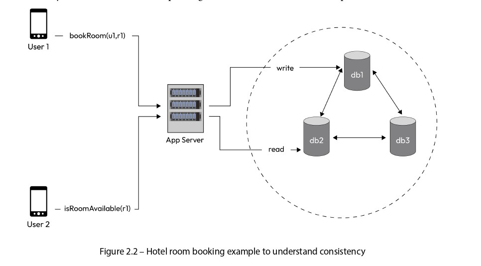

# **A Hotel Room Booking Example** 🏨

Before diving into the attributes of a distributed system, let’s establish a clear context by examining how reads and writes occur in a practical scenario. 📝 This example will help illustrate the importance of system design in managing data consistency, latency, and resource usage in a distributed environment.

  

We’ll explore a **hotel room booking application** as shown in **Figure 2.1**. The high-level design diagram provides a visual representation of how writes (data updates) and reads (data retrievals) happen in a distributed system. 🌐 This example highlights the challenges of maintaining consistency across multiple database replicas while ensuring performance and reliability.

## Scenario Overview 🔍
In this scenario:  
- A user (**u1**) wants to book a room (**r1**) in a hotel.  
- Another user (**u2**) is simultaneously checking the availability of the same room (**r1**).  
- The system uses three replicas of the reservations database: **db1**, **db2**, and **db3**. These replicas ensure data redundancy, meaning if one database fails, the system can still operate using the others.  
- Replication (copying data across replicas) can happen in two ways:  
  1. The **app server** explicitly writes to all replicas. ✍️  
  2. The database itself has built-in replication support, automatically syncing writes across replicas without the app server’s involvement. 🔄  

This setup is typical in distributed systems, where data is replicated to improve fault tolerance and availability. However, it introduces challenges like ensuring all replicas have the same data (consistency) and managing the speed of operations (latency). Let’s break down the **write** and **read** flows in detail.

---

## Write Flow 📤
The write flow describes the process when user **u1** books room **r1**. Here’s how it unfolds:  
1. **User u1’s Device Sends a Request**: The client (e.g., a mobile app or website) makes an API call to the app server using the function `bookRoom(u1, r1)`. This request tells the server that user u1 wants to book room r1.  
2. **App Server Processes the Request**: The app server receives the API call and decides how to update the database replicas (db1, db2, db3) with the booking information.  
3. **Writing to Replicas**: The app server writes the booking data to one or more replicas, depending on the chosen write strategy (explained below).  
4. **Acknowledgment to the Client**: Once the write operation is deemed successful (based on the strategy), the app server sends an acknowledgment (ack) back to u1’s device, confirming that the room has been booked.

The method used to write to the replicas significantly impacts the system’s performance, consistency, and resource usage. We’ll explore the different write options shortly.

---

## Read Flow 📥
The read flow describes the process when user **u2** checks the availability of room **r1**. Here’s the step-by-step breakdown:  
1. **User u2’s Device Sends a Request**: The client makes an API call to the app server using the function `isRoomAvailable(r1)`. This request asks the server to check if room r1 is still available.  
2. **App Server Processes the Request**: The app server receives the API call and needs to fetch the current status of room r1 from the database replicas.  
3. **Reading from Replicas**: The app server reads the data from one or more replicas, depending on the chosen read strategy (explained below).  
4. **Response to the Client**: After retrieving the data, the app server sends a response back to u2’s device, indicating whether room r1 is available or not.

The read strategy affects how quickly u2 gets a response and whether the response is accurate (e.g., if u1’s booking hasn’t yet been fully replicated, u2 might see stale data). Let’s now dive into the specific options for writes and reads.

---

## Write Options ✍️
The app server has several strategies for writing data to the database replicas. Each option has trade-offs in terms of **latency** (how fast the user gets a response), **consistency** (ensuring all replicas have the same data), and **resource usage** (e.g., server threads or network bandwidth). Here are the options:

### 1. Serial Sync Writes 🔗  
In this approach, the app server writes to the replicas one after another, waiting for each to confirm the write before proceeding:  
- The server writes to **db1** and waits for an acknowledgment (ack).  
- Once db1 acknowledges, the server writes to **db2** and waits for its ack.  
- After db2 acknowledges, the server writes to **db3** and waits for its ack.  
- Finally, after all replicas acknowledge, the server sends an ack to the client (u1’s device).  

**Characteristics**:  
- **High Latency ⏳**: Since the server waits for each replica to respond before moving to the next, the total time to complete the write is the sum of all individual write times. For example, if each write takes 1 second, the total latency for u1 is 3 seconds.  
- **High Consistency ✅**: All replicas are updated before the client gets a response, ensuring strong consistency (all replicas have the same data).  
- **Use Case**: Suitable for scenarios where data consistency is critical, and latency is less of a concern (e.g., financial transactions where accuracy is non-negotiable).  

### 2. Serial Async Writes ⏩  
In this approach, the app server writes to one replica and immediately responds to the client, updating the other replicas in the background:  
- The server writes to **db1** and waits for its ack.  
- Once db1 acknowledges, the server sends an ack to the client (u1’s device).  
- In the background (asynchronously), the server updates **db2** and **db3** without making the client wait.  

**Characteristics**:  
- **Low Latency ⚡**: The client gets a response as soon as db1 acknowledges, so the latency is just the time for one write (e.g., 1 second).  
- **Potential Inconsistency ⚠️**: Since db2 and db3 are updated asynchronously, there’s a brief period where they might not reflect the booking, leading to potential inconsistencies (e.g., u2 might see the room as available).  
- **Use Case**: Useful when low latency is a priority, and temporary inconsistencies are acceptable (e.g., social media posts where eventual consistency is fine).  

### 3. Parallel Async Writes 🚀  
Here, the app server sends write requests to all replicas simultaneously but doesn’t wait for all of them to respond before acknowledging the client:  
- The server sends write requests to **db1**, **db2**, and **db3** at the same time.  
- It waits for a minimum number of acks (e.g., 1 or k out of 3) and then sends an ack to the client.  
- The remaining replicas continue to process the write in the background.  

**Characteristics**:  
- **Low Latency ⚡**: Since the server doesn’t wait for all replicas, the latency is roughly the time for the fastest replica to respond (e.g., 1 second).  
- **High Resource Usage 🧵**: Sending requests to all replicas simultaneously consumes more server threads and network bandwidth.  
- **Potential Inconsistency ⚠️**: Similar to serial async writes, some replicas might lag, leading to temporary inconsistencies.  
- **Use Case**: Ideal for high-throughput systems where speed is critical, and resources are abundant (e.g., e-commerce platforms during sales).  

### 4. Write to a Messaging Service (e.g., Kafka) 📨  
In this approach, the app server offloads the write to a messaging service like Kafka, which acts as a middleman:  
- The server writes the booking data to a Kafka topic and immediately sends an ack to the client.  
- A separate consumer process reads the data from Kafka and applies the write to the replicas using any of the above methods (serial sync, serial async, or parallel async).  

**Characteristics**:  
- **Lowest Latency 🌟**: The client gets a response as soon as the data is written to Kafka, which is very fast (e.g., milliseconds).  
- **High Scalability 📈**: Kafka can handle a massive volume of writes, making this ideal for systems with heavy traffic.  
- **Eventual Consistency ⚠️**: The replicas are updated later, so there’s a delay before all replicas reflect the booking.  
- **Use Case**: Perfect for systems with extremely high write volumes, such as logging systems or real-time analytics platforms.  

---

## Read Options 📖
When user **u2** checks the availability of room **r1**, the app server must read the data from the replicas. The read strategy determines how accurate the response is (consistency) and how fast it’s delivered (latency). Here are the options:

### 1. Read from Only One Replica 📋  
The app server reads the data from a single replica (e.g., db1) and returns the result to the client:  
- The server sends a read request to **db1**.  
- Once db1 responds, the server sends the availability status to u2’s device.  

**Characteristics**:  
- **Fast ⚡**: Reading from one replica is the quickest option since there’s no need to query multiple sources.  
- **Risk of Stale Data 🚫**: If db1 hasn’t been updated with u1’s booking (e.g., due to async replication), u2 might see the room as available when it’s actually booked. This is a **correctness problem**.  
- **Use Case**: Suitable for non-critical reads where speed matters more than accuracy (e.g., showing approximate stock counts on an e-commerce site).  

### 2. Read from a Quorum Number of Replicas 🗳️  
The app server reads from a quorum (a majority) of replicas to ensure better consistency:  
- For three replicas (db1, db2, db3), a quorum might be 2 out of 3.  
- The server sends read requests to at least two replicas, waits for their responses, and compares the data.  
- It then returns the most consistent or latest value to the client.  

**Characteristics**:  
- **Balanced Approach ⚖️**: Reading from a quorum provides a good trade-off between speed and consistency. It’s slower than reading from one replica but faster than reading from all.  
- **Better Consistency ✅**: Since the server checks multiple replicas, it’s more likely to get the latest data (e.g., if db1 is stale but db2 is updated, the server can use db2’s data).  
- **Use Case**: Common in systems where consistency is important but latency is still a concern (e.g., booking systems where availability must be mostly accurate).  

### 3. Read from All Replicas 📚  
The app server reads from all replicas and compares the results to ensure the most accurate response:  
- The server sends read requests to **db1**, **db2**, and **db3**.  
- It waits for all replicas to respond, compares their values (e.g., using timestamps to determine the latest update), and returns the correct availability status to the client.  

**Characteristics**:  
- **Highest Consistency ✅**: This method guarantees that the server gets the latest data by checking all replicas, avoiding the correctness problem.  
- **Slowest ⏳**: Waiting for all replicas increases latency, especially if one replica is slow or unavailable.  
- **Use Case**: Best for scenarios where accuracy is critical, and latency is less of a concern (e.g., financial systems where showing the wrong balance could cause issues).  

---

## Consistency Trade-offs ⚖️
Each read option involves a trade-off between **consistency** (how accurate the data is) and **latency** (how fast the response is):  
- **Reading from One Replica** is the fastest but risks returning stale data, which can lead to a **correctness problem**. For example, if u1 books room r1 but db1 hasn’t been updated, u2 might see the room as available and try to book it, causing a conflict. 🚫  
- **Reading from All Replicas** ensures the highest consistency by comparing all values to find the latest one, but it’s the slowest due to the need to wait for all responses. This solves the correctness problem but at the cost of higher latency. ⏳  
- **Reading from a Quorum Number of Replicas** strikes a balance: it provides better consistency than reading from one replica while being faster than reading from all. This is often the preferred approach in distributed systems. ✅  

These trade-offs are a core challenge in distributed system design. The choice of read and write strategies depends on the application’s requirements:  
- If speed is critical (e.g., a real-time chat app), you might prioritize low latency and accept eventual consistency.  
- If accuracy is non-negotiable (e.g., a banking app), you might prioritize strong consistency and accept higher latency.  

We will explore these trade-offs in greater depth in the following sections, diving into concepts like eventual consistency, strong consistency, and how to balance them in a distributed environment. 🔍

---

# **Consistency in Distributed System Design** 🖥️

Consistency in distributed system design is the idea that all nodes in a distributed system should agree on the same state or view of the data, even though the data may be replicated and distributed across multiple nodes. 🌐 In other words, consistency ensures that all nodes store the same data and return updates to the data in the same order when queried for the same updates. This concept is crucial for ensuring reliability and predictability in distributed systems. 📊

There are primarily two types of consistency models that can be used in distributed systems:

- **Strong Consistency** 🔒
- **Eventual Consistency** ⏳

Let’s explore these models in detail, using a hotel room booking example to illustrate their implications.

---

## Strong Consistency 🔒

Strong consistency in distributed systems refers to a property that ensures all nodes in the system observe the same order of updates to shared data. It guarantees that when a write operation is performed, any subsequent read operation will always return the most recent value. 📝 Strong consistency enforces strict synchronization and order of operations, providing a **linearizable view** of the system, meaning the system behaves as if all operations happen sequentially in a predictable order.

### How Is Strong Consistency Achieved? 🛠️

To achieve strong consistency, distributed systems employ mechanisms such as:

- **Distributed Transactions**: Updates across nodes are treated as a single transaction, ensuring all nodes are updated together.
- **Distributed Locking**: A node locks the data to prevent concurrent updates until the operation is complete. 🔐
- **Consensus Protocols**: Algorithms like Raft or Paxos are used to ensure all nodes agree on the order of updates and maintain a consistent state. 🤝

These mechanisms coordinate the execution of operations across multiple nodes, ensuring that all nodes agree on the order of updates and maintain a consistent state.

### Advantages and Disadvantages ✅❌

- **Advantages**:
  - **Predictable Behavior**: Strong consistency offers a straightforward and intuitive programming model, as it guarantees predictable and deterministic behavior. Developers can reason about the system’s state and make assumptions based on the order of operations. 🧠
  - **Ideal for Critical Systems**: It’s perfect for applications where data accuracy is non-negotiable, such as financial systems. 💸
- **Disadvantages**:
  - **Increased Latency**: Achieving strong consistency often requires waiting for synchronization or consensus across nodes, leading to higher latency. ⏳
  - **Reduced Availability**: The system may become unavailable if nodes need to wait for synchronization, especially during network partitions or failures. 🚫

### Example: Banking System 💰

A good example of a system that requires a strong consistency model is a banking system. Banking and financial applications deal with sensitive data, such as account balances and transaction histories. Ensuring strong consistency is crucial to avoid discrepancies and prevent erroneous operations that could lead to financial losses or incorrect accounting. For instance, if a user transfers money, the balance must be updated immediately across all nodes to prevent another transaction from using an outdated balance, which could result in overdraft or errors.

---

## Eventual Consistency ⏳

Eventual consistency, on the other hand, is a consistency model that allows for temporary inconsistencies in the system but guarantees that eventually, all replicas or nodes will converge to a consistent state. 🌟 In other words, it allows updates made to the system to propagate asynchronously across different nodes, and eventually, all replicas will agree on the same value.

Unlike strong consistency, where all nodes observe the same order of updates in real-time, eventual consistency relaxes the synchronization requirements and accepts that there may be a period during which different nodes have different views of the system’s state. This temporary inconsistency is typically due to factors such as network delays, message propagation, or replica synchronization.

### How Does Eventual Consistency Work? 🔄

Eventual consistency is often achieved through techniques such as:

- **Conflict Resolution**: When concurrent updates occur on different nodes, the system resolves conflicts (e.g., by choosing the latest update based on timestamps). ⚖️
- **Replication**: Updates are propagated to multiple replicas asynchronously, allowing nodes to update at different times. 📤
- **Gossip Protocols**: Nodes share updates with each other in a decentralized manner, gradually disseminating updates across the system. 🗣️

When conflicts occur, such as concurrent updates to the same data on different nodes, the system applies conflict resolution strategies to reconcile the differences and converge toward a consistent state.

### Key Characteristic 🔑

The key characteristic of eventual consistency is that, given enough time without further updates or conflicts, all replicas will eventually converge to the same value. The convergence time depends on factors such as:

- Network latency (how long it takes for data to travel between nodes). 🌍
- Update frequency (how often updates are made). 📅
- Conflict resolution mechanisms (how conflicts are resolved). 🛠️

### Advantages and Disadvantages ✅❌

- **Advantages**:
  - **Increased Availability**: Eventual consistency allows nodes to continue operating and serving requests, even during network partitions or temporary failures. 🌟
  - **Scalability**: It enables workload distribution across replicas, improving system performance and scalability. 📈
  - **Faster Response Times**: Since there’s no need to wait for synchronization, clients get quicker responses. ⚡
- **Disadvantages**:
  - **Temporary Inconsistencies**: Applications must handle scenarios where different nodes may have different views of the system’s state. 🚨
  - **Conflict Management**: Techniques like conflict resolution, versioning, or reconciliation algorithms are needed to ensure eventual convergence. ⚙️

### Example: Social Media Platform 📱

Eventual consistency is often used in social media platforms like Instagram. When a user uploads a post, it might be immediately visible to some users but take a few seconds to appear for others. This temporary inconsistency is acceptable because availability and speed are prioritized over immediate consistency in such systems.

---

  

## Hotel Room Booking Example (Figure 2.2) 🏨

Let’s apply these concepts to the hotel room booking example, as shown in **Figure 2.2**, to understand how consistency models impact system behavior.

### Scenario Overview 🔍

- **User (u1)** books room (r1). The write operation goes to **db1**, and then the update is replicated to **db2** and **db3**.
- While replication is happening, **user (u2)** makes an API call (`isRoomAvailable(r1)`) to check if room (r1) is available.
- **Potential Issue**: Depending on whether the write has been replicated to db2 or db3, the API call might return:
  - **True** (room is available) if the replica hasn’t been updated yet.
  - **False** (room is booked) if the replica reflects the latest write.

### Consistency Challenge ⚖️

- With **strong consistency**, u2 would always see the latest data (room is booked), but this might come at the cost of higher latency since the system would need to ensure all replicas are synchronized before responding.
- With **eventual consistency**, u2 might see stale data (room is available) because replication hasn’t completed, but the response would be faster since the system doesn’t wait for synchronization.

---

## Designing Consistency in the Hotel Booking System 🛠️

As system designers, we have the option to design for either **strong consistency** or **eventual consistency**. The choice depends on how we configure the read and write operations across the replicas. Let’s define the parameters:

- **n** = The number of replicas (in this case, 3: db1, db2, db3).
- **r** = The number of replicas we consider reading from.
- **w** = The number of replicas we consider writing to.

We communicate with all **n** replicas but evaluate responses from **w** (for writes) or **r** (for reads) replicas to determine the outcome.

### Consistency Options 📋

Here are the possible configurations and their implications:

1. **w=1, r=3 → Strong Consistency, Fast Writes, Slow Reads** 🚀

   - **Writes**: The write goes to 1 replica (e.g., db1), and the client gets an acknowledgment quickly.
   - **Reads**: The system reads from all 3 replicas and determines the latest value, which makes reads slower but ensures consistency.
   - **Result**: Strong consistency because reading from all replicas guarantees the latest data.

2. **w=3, r=1 → Strong Consistency, Slow Writes, Fast Reads** 🐢

   - **Writes**: The write goes to all 3 replicas, and the client must wait for all replicas to acknowledge, making writes slow.
   - **Reads**: The system reads from 1 replica, which is fast.
   - **Result**: Strong consistency because all replicas are updated before any read occurs, ensuring the read gets the latest data.

3. **w=2, r=2 → Strong Consistency, Writes and Reads at the Same Pace** ⚖️

   - **Writes**: The write goes to 2 replicas, with moderate latency.
   - **Reads**: The system reads from 2 replicas, also with moderate latency.
   - **Result**: Strong consistency because w + r = 4, which is greater than n (3), ensuring an overlap that guarantees the latest data.

4. **w=1, r=1 → Eventual Consistency, Fast Writes, Fast Reads** ⚡

   - **Writes**: The write goes to 1 replica, which is fast.
   - **Reads**: The system reads from 1 replica, which is also fast.
   - **Result**: Eventual consistency because w + r = 2, which is less than n (3), meaning there’s no guaranteed overlap, and stale data might be read.

### Consistency Formula 📐

- If **r + w &gt; n**, the system achieves **strong consistency** because there’s an overlap between the replicas written to and read from, ensuring the latest data is always accessed.
- If **r + w ≤ n**, the system achieves **eventual consistency** because there’s no guaranteed overlap, leading to potential temporary inconsistencies.

---

## Is Eventual Consistency Okay for Hotel Booking? 🤔

In the hotel room booking use case, which consistency model should we choose?

- **Strong Consistency**: This seems like the obvious choice because if u2 sees stale data and tries to book the same room, it could lead to a double booking, which is a significant problem. Strong consistency ensures u2 always sees the latest data (room is booked), avoiding conflicts. ✅
- **Eventual Consistency**: If we prioritize availability (the system staying operational even during failures), we might choose eventual consistency. This would make the system faster and more available but risks temporary inconsistencies like double bookings. ⚠️

### Trade-offs ⚖️

- **Strong Consistency**: Ensures correctness and avoids double bookings but may increase latency and reduce availability if replicas need to synchronize.
- **Eventual Consistency**: Offers faster responses and higher availability but risks issues like double bookings, which could frustrate users.

In most hotel booking systems, **strong consistency** is preferred because correctness and user experience (avoiding double bookings) are critical. However, if the system needs to handle extremely high traffic and availability is a higher priority, eventual consistency might be considered as a trade-off.

---