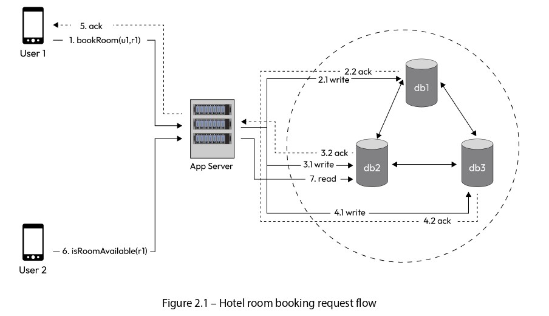

# **A Hotel Room Booking Example** 🏨

Before diving into the attributes of a distributed system, let’s establish a clear context by examining how reads and writes occur in a practical scenario. 📝 This example will help illustrate the importance of system design in managing data consistency, latency, and resource usage in a distributed environment.

  

We’ll explore a **hotel room booking application** as shown in **Figure 2.1**. The high-level design diagram provides a visual representation of how writes (data updates) and reads (data retrievals) happen in a distributed system. 🌐 This example highlights the challenges of maintaining consistency across multiple database replicas while ensuring performance and reliability.

## Scenario Overview 🔍
In this scenario:  
- A user (**u1**) wants to book a room (**r1**) in a hotel.  
- Another user (**u2**) is simultaneously checking the availability of the same room (**r1**).  
- The system uses three replicas of the reservations database: **db1**, **db2**, and **db3**. These replicas ensure data redundancy, meaning if one database fails, the system can still operate using the others.  
- Replication (copying data across replicas) can happen in two ways:  
  1. The **app server** explicitly writes to all replicas. ✍️  
  2. The database itself has built-in replication support, automatically syncing writes across replicas without the app server’s involvement. 🔄  

This setup is typical in distributed systems, where data is replicated to improve fault tolerance and availability. However, it introduces challenges like ensuring all replicas have the same data (consistency) and managing the speed of operations (latency). Let’s break down the **write** and **read** flows in detail.

---

## Write Flow 📤
The write flow describes the process when user **u1** books room **r1**. Here’s how it unfolds:  
1. **User u1’s Device Sends a Request**: The client (e.g., a mobile app or website) makes an API call to the app server using the function `bookRoom(u1, r1)`. This request tells the server that user u1 wants to book room r1.  
2. **App Server Processes the Request**: The app server receives the API call and decides how to update the database replicas (db1, db2, db3) with the booking information.  
3. **Writing to Replicas**: The app server writes the booking data to one or more replicas, depending on the chosen write strategy (explained below).  
4. **Acknowledgment to the Client**: Once the write operation is deemed successful (based on the strategy), the app server sends an acknowledgment (ack) back to u1’s device, confirming that the room has been booked.

The method used to write to the replicas significantly impacts the system’s performance, consistency, and resource usage. We’ll explore the different write options shortly.

---

## Read Flow 📥
The read flow describes the process when user **u2** checks the availability of room **r1**. Here’s the step-by-step breakdown:  
1. **User u2’s Device Sends a Request**: The client makes an API call to the app server using the function `isRoomAvailable(r1)`. This request asks the server to check if room r1 is still available.  
2. **App Server Processes the Request**: The app server receives the API call and needs to fetch the current status of room r1 from the database replicas.  
3. **Reading from Replicas**: The app server reads the data from one or more replicas, depending on the chosen read strategy (explained below).  
4. **Response to the Client**: After retrieving the data, the app server sends a response back to u2’s device, indicating whether room r1 is available or not.

The read strategy affects how quickly u2 gets a response and whether the response is accurate (e.g., if u1’s booking hasn’t yet been fully replicated, u2 might see stale data). Let’s now dive into the specific options for writes and reads.

---

## Write Options ✍️
The app server has several strategies for writing data to the database replicas. Each option has trade-offs in terms of **latency** (how fast the user gets a response), **consistency** (ensuring all replicas have the same data), and **resource usage** (e.g., server threads or network bandwidth). Here are the options:

### 1. Serial Sync Writes 🔗  
In this approach, the app server writes to the replicas one after another, waiting for each to confirm the write before proceeding:  
- The server writes to **db1** and waits for an acknowledgment (ack).  
- Once db1 acknowledges, the server writes to **db2** and waits for its ack.  
- After db2 acknowledges, the server writes to **db3** and waits for its ack.  
- Finally, after all replicas acknowledge, the server sends an ack to the client (u1’s device).  

**Characteristics**:  
- **High Latency ⏳**: Since the server waits for each replica to respond before moving to the next, the total time to complete the write is the sum of all individual write times. For example, if each write takes 1 second, the total latency for u1 is 3 seconds.  
- **High Consistency ✅**: All replicas are updated before the client gets a response, ensuring strong consistency (all replicas have the same data).  
- **Use Case**: Suitable for scenarios where data consistency is critical, and latency is less of a concern (e.g., financial transactions where accuracy is non-negotiable).  

### 2. Serial Async Writes ⏩  
In this approach, the app server writes to one replica and immediately responds to the client, updating the other replicas in the background:  
- The server writes to **db1** and waits for its ack.  
- Once db1 acknowledges, the server sends an ack to the client (u1’s device).  
- In the background (asynchronously), the server updates **db2** and **db3** without making the client wait.  

**Characteristics**:  
- **Low Latency ⚡**: The client gets a response as soon as db1 acknowledges, so the latency is just the time for one write (e.g., 1 second).  
- **Potential Inconsistency ⚠️**: Since db2 and db3 are updated asynchronously, there’s a brief period where they might not reflect the booking, leading to potential inconsistencies (e.g., u2 might see the room as available).  
- **Use Case**: Useful when low latency is a priority, and temporary inconsistencies are acceptable (e.g., social media posts where eventual consistency is fine).  

### 3. Parallel Async Writes 🚀  
Here, the app server sends write requests to all replicas simultaneously but doesn’t wait for all of them to respond before acknowledging the client:  
- The server sends write requests to **db1**, **db2**, and **db3** at the same time.  
- It waits for a minimum number of acks (e.g., 1 or k out of 3) and then sends an ack to the client.  
- The remaining replicas continue to process the write in the background.  

**Characteristics**:  
- **Low Latency ⚡**: Since the server doesn’t wait for all replicas, the latency is roughly the time for the fastest replica to respond (e.g., 1 second).  
- **High Resource Usage 🧵**: Sending requests to all replicas simultaneously consumes more server threads and network bandwidth.  
- **Potential Inconsistency ⚠️**: Similar to serial async writes, some replicas might lag, leading to temporary inconsistencies.  
- **Use Case**: Ideal for high-throughput systems where speed is critical, and resources are abundant (e.g., e-commerce platforms during sales).  

### 4. Write to a Messaging Service (e.g., Kafka) 📨  
In this approach, the app server offloads the write to a messaging service like Kafka, which acts as a middleman:  
- The server writes the booking data to a Kafka topic and immediately sends an ack to the client.  
- A separate consumer process reads the data from Kafka and applies the write to the replicas using any of the above methods (serial sync, serial async, or parallel async).  

**Characteristics**:  
- **Lowest Latency 🌟**: The client gets a response as soon as the data is written to Kafka, which is very fast (e.g., milliseconds).  
- **High Scalability 📈**: Kafka can handle a massive volume of writes, making this ideal for systems with heavy traffic.  
- **Eventual Consistency ⚠️**: The replicas are updated later, so there’s a delay before all replicas reflect the booking.  
- **Use Case**: Perfect for systems with extremely high write volumes, such as logging systems or real-time analytics platforms.  

---

## Read Options 📖
When user **u2** checks the availability of room **r1**, the app server must read the data from the replicas. The read strategy determines how accurate the response is (consistency) and how fast it’s delivered (latency). Here are the options:

### 1. Read from Only One Replica 📋  
The app server reads the data from a single replica (e.g., db1) and returns the result to the client:  
- The server sends a read request to **db1**.  
- Once db1 responds, the server sends the availability status to u2’s device.  

**Characteristics**:  
- **Fast ⚡**: Reading from one replica is the quickest option since there’s no need to query multiple sources.  
- **Risk of Stale Data 🚫**: If db1 hasn’t been updated with u1’s booking (e.g., due to async replication), u2 might see the room as available when it’s actually booked. This is a **correctness problem**.  
- **Use Case**: Suitable for non-critical reads where speed matters more than accuracy (e.g., showing approximate stock counts on an e-commerce site).  

### 2. Read from a Quorum Number of Replicas 🗳️  
The app server reads from a quorum (a majority) of replicas to ensure better consistency:  
- For three replicas (db1, db2, db3), a quorum might be 2 out of 3.  
- The server sends read requests to at least two replicas, waits for their responses, and compares the data.  
- It then returns the most consistent or latest value to the client.  

**Characteristics**:  
- **Balanced Approach ⚖️**: Reading from a quorum provides a good trade-off between speed and consistency. It’s slower than reading from one replica but faster than reading from all.  
- **Better Consistency ✅**: Since the server checks multiple replicas, it’s more likely to get the latest data (e.g., if db1 is stale but db2 is updated, the server can use db2’s data).  
- **Use Case**: Common in systems where consistency is important but latency is still a concern (e.g., booking systems where availability must be mostly accurate).  

### 3. Read from All Replicas 📚  
The app server reads from all replicas and compares the results to ensure the most accurate response:  
- The server sends read requests to **db1**, **db2**, and **db3**.  
- It waits for all replicas to respond, compares their values (e.g., using timestamps to determine the latest update), and returns the correct availability status to the client.  

**Characteristics**:  
- **Highest Consistency ✅**: This method guarantees that the server gets the latest data by checking all replicas, avoiding the correctness problem.  
- **Slowest ⏳**: Waiting for all replicas increases latency, especially if one replica is slow or unavailable.  
- **Use Case**: Best for scenarios where accuracy is critical, and latency is less of a concern (e.g., financial systems where showing the wrong balance could cause issues).  

---

## Consistency Trade-offs ⚖️
Each read option involves a trade-off between **consistency** (how accurate the data is) and **latency** (how fast the response is):  
- **Reading from One Replica** is the fastest but risks returning stale data, which can lead to a **correctness problem**. For example, if u1 books room r1 but db1 hasn’t been updated, u2 might see the room as available and try to book it, causing a conflict. 🚫  
- **Reading from All Replicas** ensures the highest consistency by comparing all values to find the latest one, but it’s the slowest due to the need to wait for all responses. This solves the correctness problem but at the cost of higher latency. ⏳  
- **Reading from a Quorum Number of Replicas** strikes a balance: it provides better consistency than reading from one replica while being faster than reading from all. This is often the preferred approach in distributed systems. ✅  

These trade-offs are a core challenge in distributed system design. The choice of read and write strategies depends on the application’s requirements:  
- If speed is critical (e.g., a real-time chat app), you might prioritize low latency and accept eventual consistency.  
- If accuracy is non-negotiable (e.g., a banking app), you might prioritize strong consistency and accept higher latency.  

We will explore these trade-offs in greater depth in the following sections, diving into concepts like eventual consistency, strong consistency, and how to balance them in a distributed environment. 🔍

---